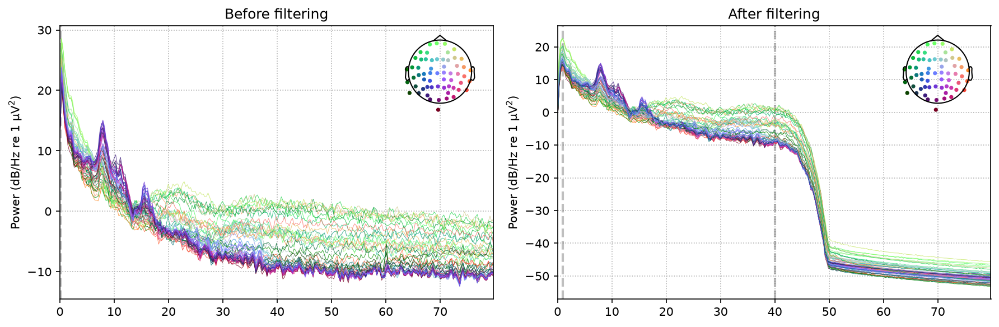

# EEG Preprocessing & Analysis Pipeline


An end-to-end EEG signal-processing pipeline built in MNE-Python — raw data loading through
filtering, epoching, artifact rejection, ICA, ERP/time-frequency analysis, and motor-imagery
classification. Built as a portfolio project demonstrating the core preprocessing and analysis
skills used in BCI/neurotech research and engineering roles.

## Contents
- [What This Is](#what-this-is-and-why-it-exists)
- [Example Output](#example-output)
- [Pipeline Modules](#pipeline-modules)
- [Repository Structure](#repository-structure)
- [Setup](#setup)
- [Running the Pipeline](#running-the-pipeline)
- [Dataset](#dataset)
- [Testing](#testing)

## What this is and why it exists

This project was built module by module (M0 through M9), each stage committed and merged
independently, to demonstrate real, incremental engineering work rather than one large
uncommitted dump of code. Every processing parameter — filter cutoffs, epoch windows, ICA
settings, classifier folds — is driven by `config.yaml`, not hardcoded across files, so the
entire pipeline can be re-run against a different dataset or parameter set by editing one file.

## Example Output



Power spectral density of the MNE sample dataset's EEG channels, before and after the
pipeline's notch + bandpass filter stage. The 1–40 Hz passband edges are visible as sharp
transitions, and power outside that band (including 60 Hz line noise) drops off steeply once
filtered.

## Pipeline Modules

- **M0 — Scaffold:** project structure, `config.yaml`, and `pipeline.py` orchestrator skeleton.
- **M1 — Data Loading (`src/preprocessing/loader.py`):** loads raw EEG from `.fif` or `.edf`
  files into an MNE `Raw` object; the single entry point every downstream module builds on.
- **M2 — Filtering (`src/preprocessing/filter.py`):** removes power-line hum (notch filter) and
  out-of-band drift/noise (bandpass filter) before any further processing.
- **M3 — Epoching (`src/preprocessing/epoching.py`):** cuts the continuous filtered signal into
  short, event-locked trial windows.
- **M4 — Artifact Rejection (`src/preprocessing/artifacts.py`):** discards whole trials whose
  peak-to-peak amplitude exceeds a physically-implausible threshold for real cortical signal.
- **M5 — ICA (`src/preprocessing/ica.py`):** separates statistically independent signal sources
  and surgically removes eye-blink components (auto-detected via correlation with a real EOG
  channel) without discarding the whole trial.
- **M6 — ERP Analysis (`src/analysis/features.py`):** averages trials to reveal stimulus-locked
  components, and compares conditions against each other rather than only a single grand average.
- **M7 — Time-Frequency Analysis (`src/analysis/features.py`):** computes power across time and
  frequency (Morlet wavelet TFR) to capture non-phase-locked effects averaging alone would cancel
  out, such as alpha suppression.
- **M8 — Inter-Trial Coherence (`src/analysis/features.py`):** measures phase consistency across
  trials, independent of power — a distinct question from M7's power analysis.
- **M9 — Classification (`src/analysis/classifier.py`):** extracts mu/beta band-power features
  per trial and cross-validates an LDA decoder — the motor-imagery / BCI-relevant capstone of
  the pipeline.

## Repository Structure

```
eeg-project/
├── pipeline.py                   # orchestrator -- reads config.yaml, runs full pipeline
├── config.yaml                   # single source of truth for all parameters
├── src/
│   ├── preprocessing/
│   │   ├── loader.py             # M1 -- load_raw, inspect_raw
│   │   ├── filter.py             # M2 -- apply_filters, save_processed
│   │   ├── epoching.py           # M3 -- make_epochs
│   │   ├── artifacts.py          # M4 -- mark_bad_channels, reject_by_amplitude, log_rejection
│   │   └── ica.py                # M5 -- fit_ica, auto_detect_eog, apply_ica
│   ├── analysis/
│   │   ├── features.py           # M6-M8 -- band_power, compute_erp, compare_conditions,
│   │   │                         #          compute_tfr, compute_itc
│   │   └── classifier.py         # M9 -- extract_band_power_features, decode_with_lda
│   └── visualization/
│       └── plot.py               # plot_erp, plot_topomap, plot_psd
├── notebooks/                     # one exploratory notebook per milestone (M1-M9)
├── tests/                          # pytest suite, mirrors src/
├── data/                            # gitignored -- local raw/processed EEG data
└── results/
    ├── figures/                      # generated + selectively committed portfolio figures
    └── reports/
```

## Setup

```bash
python -m venv .venv
.venv/Scripts/activate        # .venv/bin/activate on macOS/Linux
pip install -e ".[dev]"
```

Dependencies are declared in `pyproject.toml` (single source of truth); `requirements.txt` just
points back to it.

## Running the pipeline

`pipeline.py` chains preprocessing (load → filter → epoch → reject → ICA) → analysis (band
power, ERP, condition comparison, time-frequency, inter-trial coherence) → classification
(band-power features, cross-validated LDA) → visualization for one subject, and is resumable: it
skips the preprocessing stage when its output is already up to date with the current config, and
writes a JSON provenance sidecar next to each processed file recording exactly what parameters
produced it.

```bash
# Single subject
python pipeline.py --subject sub-01 --file path/to/raw.fif --bad-channels "EEG 053"

# Recompute even if cached output looks up to date
python pipeline.py --subject sub-01 --file path/to/raw.fif --force

# Batch mode: iterate config.yaml's `subjects` list, resolving each subject's file
# under paths.raw_data as "{subject}_raw.fif"
python pipeline.py
```

Pipeline parameters (filter cutoffs, epoch window, frequency bands, ICA settings, classifier
folds, paths) live in `config.yaml`.

## Dataset

Primary development dataset for M1 through M8: the MNE sample auditory/visual dataset (1
subject, EEG+MEG combined, ~600 Hz, ~277 s, ~320 events across auditory/visual left/right
conditions).

M9's motor-imagery classification uses the [PhysioNet EEGBCI](https://physionet.org/content/eegmmidb/1.0.0/)
dataset — imagined left/right fist movement runs, which is the condition structure the mu/beta
band-power features and LDA decoder are actually built and validated against. Running the full
pipeline (`pipeline.py`) against the sample dataset instead will still execute end-to-end, but
classifier accuracy near chance is expected there, since that dataset has no motor-imagery
conditions to decode.

## Testing

```bash
pytest              # fast suite (synthetic EEG data, no downloads)
pytest -m slow       # add the end-to-end test against the real MNE sample dataset
```
